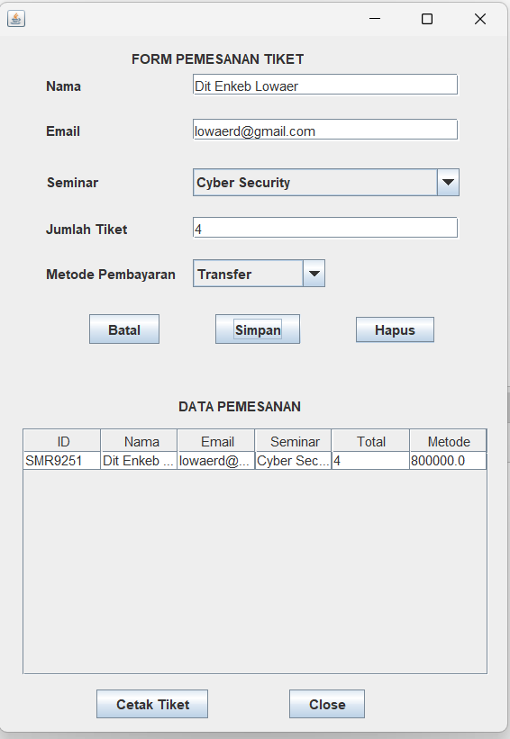

# 🎫 Sistem Pemesanan Tiket Seminar Online

  

  Aplikasi Java GUI berbasis Object Oriented Programming (OOP) untuk pemesanan tiket seminar secara interaktif.

---

## 📌 Tentang Project

Project ini dibuat sebagai bagian dari Praktikum OOP Semester 2.  
Aplikasi ini memungkinkan pengguna untuk melakukan pemesanan tiket seminar dengan tampilan GUI yang sederhana dan mudah digunakan.

---

## ✨ Fitur Utama

- 📝 Input data pemesanan (Nama, Email, Seminar, Jumlah)
- 💰 Perhitungan total harga otomatis
- 📊 Menampilkan data dalam JTable
- 🖨️ Cetak tiket seminar
- 🧹 Reset form (Batal)
- ❌ Hapus data
- 🚪 Keluar aplikasi

---

## 🧠 Konsep OOP yang Digunakan

| Konsep | Implementasi |
|--------|-------------|
| Enkapsulasi | Atribut private + getter/setter |
| Inheritance | Pembayaran → QRIS & Transfer |
| Polymorphism | Overloading & Overriding |

---

## 🛠️ Teknologi

- Java
- Java Swing
- NetBeans IDE
- Git & GitHub

---

## 📂 Struktur Project
SISeminar/

│── Pemesanan_Tiket.java

│── Pembayaran.java

│── PembayaranQRIS.java

│── PembayaranTransfer.java

│── CetakTiket.java

│── FormTiketGUI.java

---

## 🖥️ Tampilan Aplikasi

  

---

## 🚀 Cara Menjalankan

1. Clone repository:
   git clone https://github.com/lowaerd-stack/Sem2-Praktikum-OOP.git
   
2. Buka di NetBeans

3. Jalankan:

---
## 👨‍💻 Author

- Nama  : Dit Enkeb Lowaer  
- NIM   : 2518027  
- Kelas : B  

---

## 📌 Catatan

Project ini masih sederhana dan dapat dikembangkan lebih lanjut, seperti:
- Integrasi database
- Sistem login
- Export tiket ke PDF

---

  ⭐ Jika project ini membantu, jangan lupa kasih star ⭐

